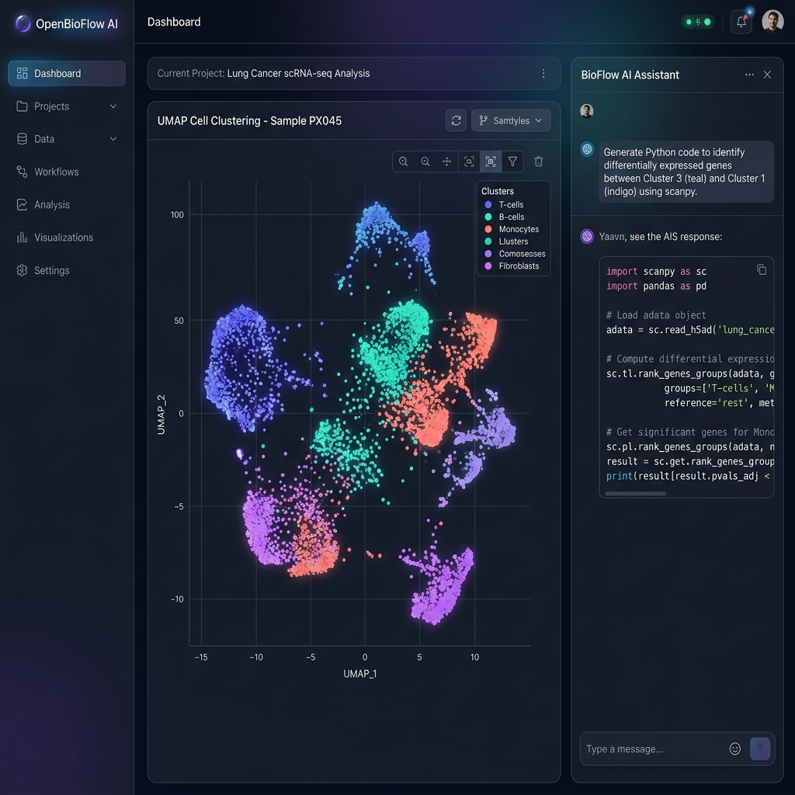

# OpenBioFlow AI

An enterprise-ready, AI-orchestrated cloud-native bioinformatics platform. OpenBioFlow AI allows researchers to analyze single-cell transcriptomics data (using Scanpy and AnnData), search biomedical literature, execute GSEA enrichment pipelines, and generate publication-ready insights orchestrated by Google Gemini.



---

## Repository Architecture

This repository is structured as a multi-language monorepo:
- **TypeScript Workspace:** Managed via `pnpm` workspaces and orchestrated by `Turborepo`.
- **Python Services:** Built with Python 3.12 and organized into microservices with individual `pyproject.toml` configurations for sandboxing and fast builds.

```
openbioflow-ai/
├── apps/
│   ├── web/                      # Next.js 15 + React + Tailwind + Zustand
│   └── api/                      # FastAPI Core API gateway
├── packages/
│   ├── ui/                       # Design system / shadcn components
│   ├── types/                    # Shared TS declarations
│   ├── config/                   # ESLint, Prettier, TS config extensions
│   └── sdk/                      # Typed API SDK
├── services/
│   ├── ai-orchestrator/          # Gemini agent coordinator
│   ├── execution-engine/         # Scanpy executor
│   ├── literature-service/       # PubMed retrieval
│   ├── report-generator/         # GSEApy & PDF report compilation
│   └── visualization-engine/     # Cell maps visualizer
├── infrastructure/
│   ├── docker/                   # Local Compose composition
│   ├── kubernetes/               # Helm & ArgoCD manifests
│   └── terraform/                # Infrastructure as Code
└── docs/                         # Technical runbooks and setup guides
```

---

## Development Prerequisites

Before running the platform locally, ensure you have installed:
1. **Node.js** >= 18.0.0 and **pnpm** >= 9.0.0
2. **Python** >= 3.12 and **uv** (recommended) or **poetry**
3. **Docker** and **Docker Compose**
4. **Git**

---

## Local Development Quickstart

### 1. Clone & Initialize Environment
```bash
git clone https://github.com/realabrar1/openbioflow
cd openbioflow-ai
```

### 2. Copy Local Configurations
Copy the baseline development environment credentials:
```bash
cp infrastructure/docker/.env.example infrastructure/docker/.env
```

### 3. Spin Up Infrastructure
Start PostgreSQL, Redis, and MinIO (mock S3 storage):
```bash
docker compose -f infrastructure/docker/docker-compose.yml up -d
```

### 4. Install TypeScript Workspaces
```bash
pnpm install
```

### 5. Start Frontend & Core API
Start the Next.js development server and the FastAPI core gateway in parallel via Turborepo:
```bash
pnpm run dev
```

---

## Common Orchestration Tasks

Our build execution is orchestrated using **Turborepo**:

*   **Start development mode:** `pnpm run dev`
*   **Compile all TS apps/libs:** `pnpm run build`
*   **Run lints globally:** `pnpm run lint`
*   **Format codebase:** `pnpm run format`

For Python specific services, run linting and code formatting using **Ruff**:
```bash
# Formats and fixes imports/lint rules inside services
ruff format .
ruff check . --fix
```

---

## Release & Deployment Workflow

This codebase follows **Trunk-Based Development** with semantic versioning.
1. All changes must be pushed to short-lived branches (`feature/OB-...` or `bugfix/OB-...`).
2. Pull requests trigger CI validations (TypeScript compilation, Vitest suites, Ruff lints, Pytest runs).
3. Merging to `main` compiles Docker images, tags them with Semantic Releases, and updates ArgoCD GitOps tracking files.

For full architecture details, refer to [docs/architecture.md](docs/architecture.md) and the [Engineering Blueprint](.gemini/antigravity-ide/brain/b50128a9-d87f-412c-84ef-ab09a4a566c8/engineering_blueprint.md).
